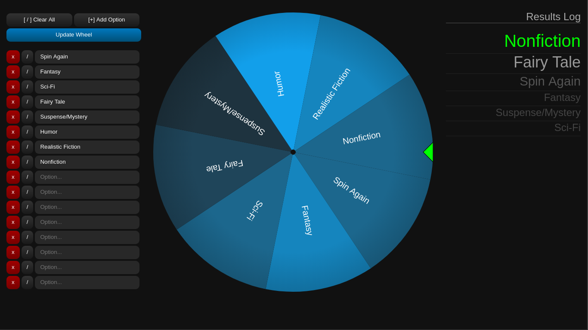

# Spinner

A little spinner wheel for random choices.

Vanilla JS, HTML, Canvas, CSS; Parcel for building/bundling.

### Try it out!

[gpow.ca/spinner](http://gpow.ca/spinner)

In order to easily serve the app on GitHub pages, `docs/` is excluded from the .gitignore, and used as the Parcel build directory.
